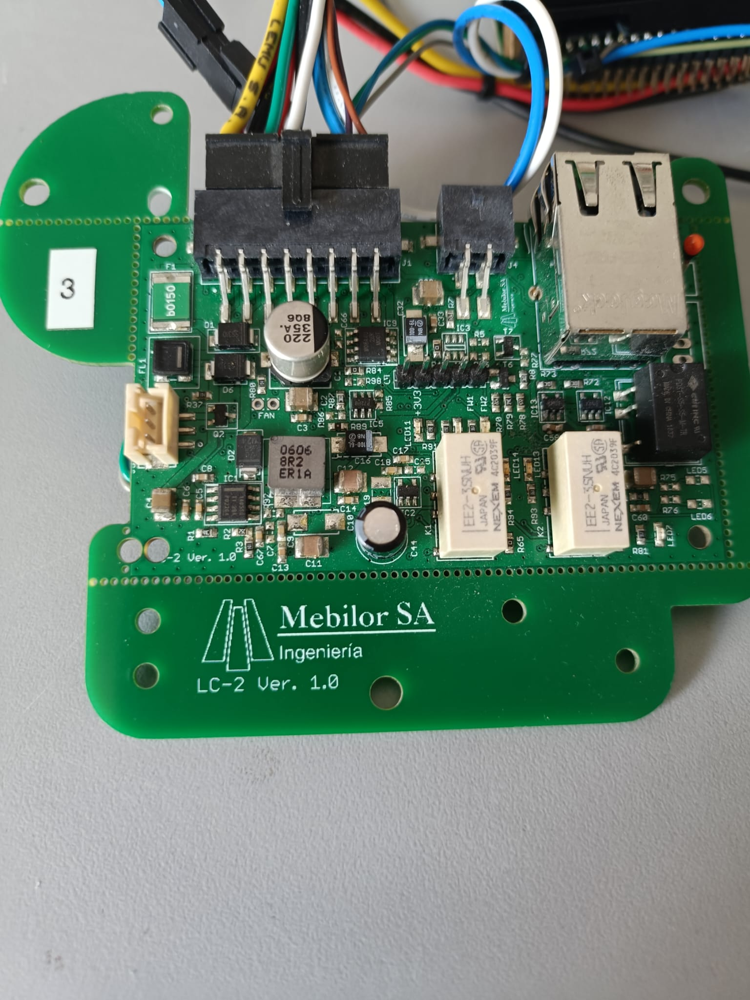

# Smart SBC Power & Telemetry Supervisor

This repository showcases a non-confidential example of a power management and telemetry supervisor designed to protect, monitor, and manage Single Board Computers (SBCs) in automotive and industrial environments.

The system acts as a "Smart UPS" and watchdog, ensuring high availability and safe operation.

---

## 🔧 Project Overview

The system acts as an intelligent supervisor responsible for:

- **Graceful Shutdown & Power Control:** Prevents data corruption by managing the SBC's boot and shutdown cycles via uart Linux console and  MOSFET-based load switching.
- **Embedded UPS:** Integrated Li-Ion battery management to keep the SBC running during vehicle cranking or power loss.
- **Active Watchdog:** Runs a dedicated heartbeat/daemon monitor to detect and recover from SBC OS freezes.
- **Vehicle Telemetry:** Data acquisition via CAN Bus (ECU data) and motion sensing.
- **Real-Time Monitoring:** High-precision V/I (Voltage/Current) and temperature sensing for the SBC and surroundings.
- **Cloud Connectivity:** Reports all telemetry and health metrics via Ethernet to an MQTT broker.
  
---

## 👨‍💻 My Role

**End-to-End Embedded System Development:**

- **Hardware architecture:** Design of the power path, MOSFET load switching, and battery management system.
- **Firmware development:** Implementation of the supervisor logic, watchdog protocols, and sensor fusion.
- **Protocol Integration:** CAN Bus decoding, MQTT payload structuring, and I2C/SPI sensor drivers.
- **Power Sequencing:** Logic design for safe startup/shutdown handshaking between the supervisor and the SBC.

---

## 🛠 Technical Stack

**Firmware:**
- **Language:** Embedded C
- **Logic:** State-machine based supervisor for power sequencing.
- **Communication:** MQTT via ethernet for cloud reporting.

**Hardware & Interfaces:**
- **CAN Bus:** Vehicle ECU and diagnostic data acquisition.
- **Power Management:** MOSFET Load Switching.
- **Sensors:** Accelerometer, NTC Temperature monitoring, and V/I sensing.
- **Power Source:** Li-Ion battery charger with voltage protection and charge balance with and automotive-grade power regulation.
- **Connectivity:** Uart, Ethernet.
- **Digital Inputs:** Digital Inputs with automotive transcient protection for ignition sensing.
- **Relay Outputs:** Dry contact relays for commanding SBC hardware buttons (Power/Reset).

**Management Features:**
- **SBC Watchdog:** Hardware-level supervision of the SBC OS status.
- **Power Save Mode:** Advanced low-power logic to preserve vehicle battery.
- **Safety:** Automatic cutoff based on temperature or voltage thresholds.

---

## 📦 Production-Oriented Design Considerations

- **Graceful Handshaking:** Ensures the SBC has finished all disk writes before cutting power.
- **Automotive Reliability:** Protection against transients and voltage drops during engine start.
- **Failsafe Recovery:** Hardware watchdog to force a hard reset if the SBC becomes unresponsive.
- **Telemetry-Driven Maintenance:** MQTT reporting for proactive health monitoring of the fleet.

---

## 📸 Hardware Showcase

Custom supervisor PCB designed for automotive reliability and seamless SBC integration:

---

## 📌 Note

This repository contains only public, non-confidential examples.  
Commercial firmware and proprietary schematics are protected under NDA and are not included.

---

[⬅ Back to Main Portfolio](https://github.com)
